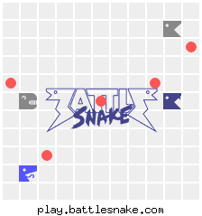

# A [Battlesnake](http://play.battlesnake.com?utm_source=github&utm_medium=readme&utm_campaign=python_starter&utm_content=homepage) powered by [Algolia Search](https://www.algolia.com/products/search-and-discovery/hosted-search-api/)

It's alive! :zap:



I played Mad Scientist and built a BattleSnake that hunts for food on the board using queries against an Algolia Search index. Her name is "Searchy". The API latency is perfectly fine and she's already won a few games.

Searchy is built using the [Python Starter Snake](https://github.com/BattlesnakeOfficial/starter-snake-python) as a foundation. `utilities/make_food_plays.py` generates all the possible positions for food in a 5x5 matrix (about 16.7 million of them). It then weights the possible moves on each board based on food positions. Finally, it creates `JSON` records of all the boards and uses the Algolia Python client to import the records into an Algolia index.

At game time, I do some quick collision evaluations in [`server_logic.py`](server_logic.py), then build a string representing a 5x5 field around her head. I use this string to query the Algolia index in [`find_boards.py`](find_board.py) to get the best moves from the list of possible boards. All the "smarts" are in the board generator, so I can work to constantly improve Searchy's vision.

I have lots of ideas on where to take it next. I could do coarse grain and fine grain searches by doing averages across the whole board and finding the best move. I'd also like to layer the collision detection into the index records so everything is pulled via queries, but I'm trying to thoughtful about my number of records/queries.

Obviously the whole thing is a little silly, but there could be some interesting things around faceting the index to pick strategies, or using geosearch instead of text search.

I'm mostly impressed I can query the result from 16mil records in < 500ms

## Technologies Used

* [Python3](https://www.python.org/)
* [Flask](https://flask.palletsprojects.com/)
* [Algolia Search](https://www.algolia.com/products/search-and-discovery/hosted-search-api/)

## Quickstart

The [Quick Start Coding Guide](https://docs.battlesnake.com/guides/getting-started) provides the full set of instructions to customize, register, and create your first games with your Battlesnake! While the guide uses [Repl.it](https://repl.it) as an example host, the instructions can be modified to work with any hosting provider. You can also find advice on other hosting providers on our [Hosting Suggestions](https://docs.battlesnake.com/references/hosting-suggestions) page.

### Prerequisites

* A free [Battlesnake Account](https://play.battlesnake.com/?utm_source=github&utm_medium=readme&utm_campaign=python_starter&utm_content=homepage)
* An [Algolia account](https://www.algolia.com/users/sign_up?utm_source=github&utm_medium=readme&utm_campaign=algolia-battlesnake&utm_id=algolia-battlesnake) _(you can use the free account for 3x3 boards, but you'll need a paid account to index the 5x5 boards)_
* An `.env` file (or equivalent) with the `ALGOLIA_APP_ID` and `ALGOLIA_API_KEY` for your Application from the Algolia Dashboard.

---

## Customizing Your Battlesnake

Locate the `handle_info` function inside [server.py](server.py#L15). At the end of that function you should see a line that looks like this:

```python
return {
    "apiversion": "1",
    "author": "",
    "color": "#888888",
    "head": "default",
    "tail": "default",
}
```

This function is called by the game engine periodically to make sure your Battlesnake is healthy, responding correctly, and to determine how your Battlesnake will appear on the game board. See [Battlesnake Personalization](https://docs.battlesnake.com/references/personalization) for how to customize your Battlesnake's appearance using these values.

Whenever you update these values, go to the page for your Battlesnake and select 'Refresh Metadata' from the option menu. This will update your Battlesnake to use your latest configuration and those changes should be reflected in the UI as well as any new games created.

## Changing Behavior

On every turn of each game your Battlesnake receives information about the game board and must decide its next move.

Locate the `handle_move` function inside [server.py](server.py#L48). Possible moves are "up", "down", "left", or "right". 

See the [Battlesnake Game Rules](https://docs.battlesnake.com/references/rules) for more information on playing the game, moving around the board, and improving your algorithm.

## (Optional) Running Your Battlesnake Locally

Eventually you might want to run your Battlesnake server locally for faster testing and debugging. You can do this by installing [Python 3.8](https://www.python.org/downloads/) and running:

```shell
python server.py
```

**Note:** You cannot create games on [play.battlesnake.com](https://play.battlesnake.com) using a locally running Battlesnake unless you install and use a port forwarding tool like [ngrok](https://ngrok.com/). See [Hosting Suggestions.](https://docs.battlesnake.com/references/hosting-suggestions#local)

## Running Tests

This Starter Project comes with a very simple test suite for you to expand! Located in `tests.py` you can run them using the following command:
```python tests.py -v```

---

## Playing Battlesnake

### Completing Challenges

If you're looking for the Single Player Mode of Battlesnake, or something to practice with between events, check out [Challenges.](https://docs.battlesnake.com/guides/quick-start-challenges-guide)

### Joining a Battlesnake Arena

Once you've made your Battlesnake behave and survive on its own, you can enter it into the [Global Battlesnake Arena](https://play.battlesnake.com/arena/global) to see how it performs against other Battlesnakes worldwide.

Arenas will regularly create new games and rank Battlesnakes based on their results. They're a good way to get regular feedback on how well your Battlesnake is performing, and a fun way to track your progress as you develop your algorithm.
